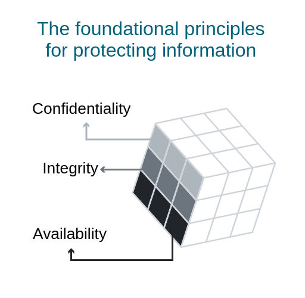

Hey there! 😃 Let's dive into the world of cybersecurity and explore the CIA Triad! Are you ready to get your brain pumping? 🥳

The CIA Triad is **a model designed to guide policies for information security within an organization**. stands for \*\*Confidentiality, Integrity, and Availability\*\*. This is like a security checklist for keeping your data safe and secure!

But let's dive a little deeper. 🧘

\*\*Confidentiality\*\* is all about keeping your data secret. It means making sure that only authorized people can access the information. If someone breaks into your computer and steals all your stuff, they're messing with your confidentiality! 😣 In other word It is a set of rules that prevents sensitive information from being disclosed to unauthorized people, resources and processes. Methods to ensure confidentiality include data encryption, identity proofing and two factor authentication.

For example, Let's say that you're playing a game with your friends and you find a really cool sword that you want to keep for yourself. You don't want anyone else to find it, so you choose a really cool hiding spot and you and your friends make a secret code so that no one else can find the sword. This is an example of confidentiality.

\*\*Integrity\*\* is about making sure that information is accurate and hasn't been tampered with. Imagine if someone hacked your bank account and added a zero to your bank balance - that would mess with your integrity! 🫠 One way to ensure integrity is to use a hash function or checksum.

Now the big one. Get ready for it. 🥊 \*\*Availability\*\* is about making sure that you can access your information when and where you need it! Imagine trying to pay your rent or submit your homework, but your computer's not working? 😠 That would totally mess with your availability! or to make it easy it means that authorized users are able to access systems and data when and where needed and those that do not meet established conditions, are not. This can be achieved by maintaining equipment, performing hardware repairs, keeping operating systems and software up to date, and creating backups.

Let's say that you're playing a video game with your friends and you're about to win. Suddenly, the game crashes and you can't play anymore. This would be an example of a lack of availability.

But don't worry, there are lots of ways to keep your data secure and safe! 💪

Let's start with \*\*Confidentiality\*\*. 🔐 When you create a password, make it strong and unique, use different passwords for different accounts, and make sure you don't share them with anyone. You can also use a password manager to keep track of all your passwords.

Now \*\*Integrity\*\*. 📝 This one's a little harder to control, but there are things you can do. For example, make sure your device is up-to-date with the latest security patches and that you only download apps from reputable sources.

Finally, \*\*Availability\*\*. ⏰ Time to set up a backup plan! Make sure your important data is backed up regularly and stored in a safe place. You can use services like Dropbox or Google Drive to store your files safely in the cloud.

That's it! Those are the basics of the CIA Triad. Remember, keeping your data safe and secure is all about being aware of the threats and taking action to protect your information. Happy securing! 🎉
